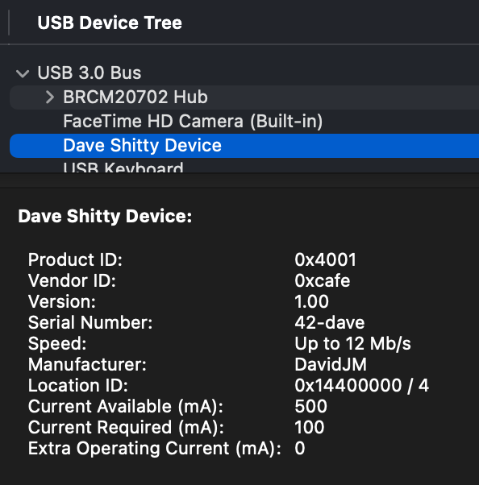
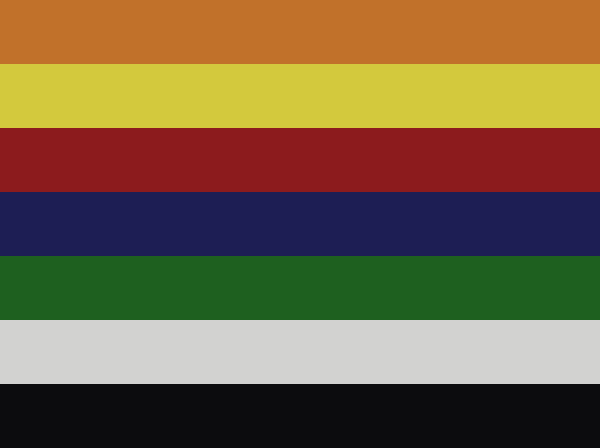
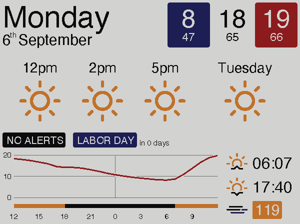
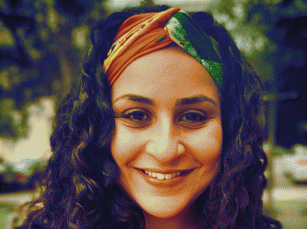
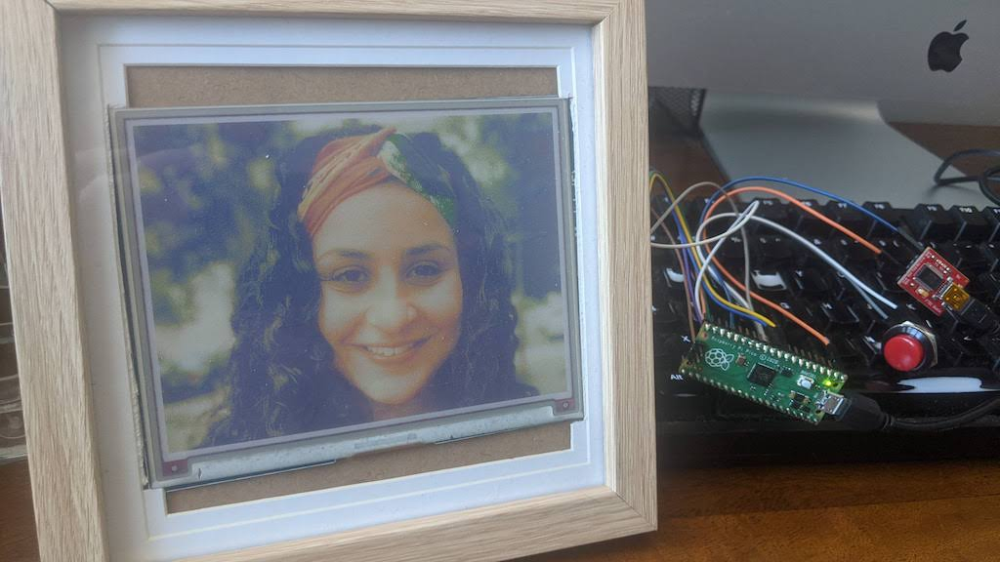

# Paperframe
Waveshare 7-colour epaper displays on microcontrollers.

The idea is to have just enough smarts running locally to display an image, rather than generate one on the device itself. In this way we can display different things for various circumstances and use cases.

## supported displays
* [5.65" 7-COLOR E-PAPER MODULE](https://www.waveshare.com/product/displays/e-paper/5.65inch-e-paper-module-f.htm)

## Supported microcontrollers
* Raspberry Pi Pico
* Maybe more coming soon. (Esp32, ... )

# Building and Development

In short, once dependancies like toolchain and CMake are installed you should just be able clone the repo and build:

```
$ git clone https://github.com/cheriff/paperframe.git
$ cd paperframe/rpi-pico
$ make
```
Please see [building](doc/building.md) for more information

# Running
When all is running well the board's LED should be slowly pulsing and Paperframe appears as USB device pressenting as a CDC serial device:



Now, the `pngpush` utility is used to send an appropriately formatted PNG image to the display:

```
$ ./rpi-pico/pngpush images/weather.png
Overall sent 5441
Finished
```

This opens the serial device (currently: `/dev/cu.usbmodem42_dave1`) and Paperframe notices the change in `dtr` which begins a new transaction. Up to 128Kbytes of .png filedata are then written, any excess is dropped and is indicative of failure. Closing the TTY device ends the transaction and the uploaded image is decoded and displayed.

Due to the nature of the E-paper display and waveshare-provided divers, screen refresh is slow (~20 seconds) and exhibits quite some flickering. This is normal.

When the refresh is complete, Paperframe resets in anticipation of receiving the next image. This is hopefully a temporary limitation.

# Image format

While appropriate images are compliant PNGs and compatible with any viewer (as best as I can tell) the reverse is not true: Paperframe does not accept all legal PNG files and certain restrictions are in place:

* File *must* be 600x448 resolution
* File *must* be palletized and use 4 bits per pixel
* Pallete *must* be exactly 7 colours long
    * Hence, only colours 0-6 may be used.
* File *must* only use row filter `0`.
    * Support for other filter types may be added later

Unsuitable images ideally are cleanly rejected but it's possible there are bugs on the failure path.

These restricitons arise from the fact that the display itself is 7-colour palletized. We can construct a .png file with a colourmap matching that of the hardware so that regular image viewers will give a good prievew of what an image will ultimately look like. When loading onto paperframe, we can push the raw index values from the decompression buffer directly to the display. This is done in a streaming manner, row by row, so that the uncompressed data does not need to exist in memory all at once.

The PNG specification allows some pre-filtering of each row in the hopes that it will aid compression. Paperframe currently does not support this and requires only filter 0 (ie: unfiltered) to be used for all rows. This is just a software limitation and may be relaxed in the future, although it is not clear if alternative filter methods are particularly useful in 4-bit indexed modes.

## Pallete

There are 7 colours allowed. These are presented below as well as their approximate RGB values (sampled from a photo of the display, taken under non-controlled lighting conditions).

| Index | Colour | RGB               | HTML    |
| ----- | -------| ----------------- | ------- |
| 0     | Black  | ( 12, 12, 14 )    | #0c0c0e |
| 1     | White  | ( 210, 210, 208 ) | #d2d2d0 |
| 2     | Green  | ( 30, 96, 31 )    | #1e601f |
| 3     | Blue   | ( 29, 30, 84 )    | #1d1e54 |
| 4     | Red    | ( 140, 27, 29 )   | #8c1b1d |
| 5     | Yellow | ( 211, 201, 61 )  | #d3c93d |
| 6     | Orange | ( 193, 113, 42 )  | #c1712a |


## Examples 

|     |     |
| --- | --- |
| The base pallete consists of seven colours. |  |
|           | Informational diagrams make good use of the colour blocks  |
| A good dithering algorithm with the fixed pallete gives the illusion of more detail: |  |

The images shown above are suitable .png files for showing on the device
And this can look surprisingly good in practice:



# TODO:
* Fix USB descriptors to be more informative
* More graceful error conditions
* Check image format in `pngpush`
* Image conversion/generation utilities
* Remove need to reset between image loads.
* Paperframe should not assert if bad image dimensions are given


